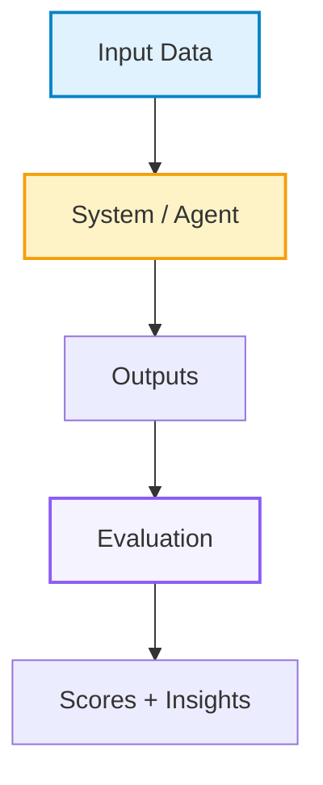

# GitHub README Writing

## 核心原则

- README 要像项目主页：第一屏让读者知道项目名、定位、入口、亮点和视觉印象。
- 严格采用 ResearchClawBench 风格：居中标题、居中 badge、短 tagline、导航链接、teaser 图、highlights 表格、news 前置、Mermaid、项目结构、quick start、community、citation、star history。
- 不要写成纯文档清单。README 应该有视觉层次、表格、图、流程图、结构树、可复制命令和明确入口。
- 可以适度使用 emoji 让 README 更活泼，但 emoji 应服务导航和语义，不要让每行都变成装饰。
- 不编造 badge、指标、论文、license、star、dataset、demo、leaderboard 或 citation。信息未知时使用占位符。
- 对外 README 不写 secret、内部路径、私有 token、未公开服务地址或不可访问链接。

## 推荐结构

按这个顺序组织：

1. Top anchor and centered title。
2. Centered badge block。
3. One-line tagline。
4. Centered navigation。
5. Optional Table of Contents for long README。
6. Teaser image or demo media。
7. One-paragraph project definition。
8. Overview：highlights table、demo、why this project、news。
9. Understanding / How It Works：Mermaid pipeline、stage explanation、rubric or workflow。
10. Results / Domains / Features：多元表格、leaderboard 或 capability matrix。
11. Project Structure：文件夹树。
12. Using The Project：quick start、install、download/configure/run/score。
13. Extension：add your own agent/task/model/plugin。
14. Community：contributing、contact、community images or links。
15. Citation。
16. Star History。
17. Back to top。

## Header 模板

README 顶部优先用 HTML 控制居中布局。

```markdown
<a id="top"></a>

<div align="center">
  <h1>[Project Name]</h1>
</div>

<div align="center">

[]([SITE_URL])&#160;
[]([GITHUB_URL])&#160;
[]([HF_URL])&#160;
[](LICENSE)
[](https://www.python.org/)
[]([GITHUB_URL])

**[Short tagline: what this project evaluates/builds/enables]**

[Quick Start](#-quick-start) | [How It Works](#%EF%B8%8F-how-it-works) | [Features](#-features) | [Leaderboard](#-leaderboard) | [Citation](#-citation)

</div>

<p align="center">
  
</p>

---
```

Badge 数量控制在 5-9 个。优先放 Official Site、GitHub、Hugging Face/Dataset、License、Python、版本/任务数/领域数、GitHub stars。

如果 README 很长，在导航后或 Overview 前加入目录。长章节末尾可加 `[Back to Table of Contents](#table-of-contents)`，主要 section 末尾可加右对齐回顶：

```markdown
## Table of Contents

- [Overview](#overview)
- [How It Works](#%EF%B8%8F-how-it-works)
- [Quick Start](#-quick-start)
- [Citation](#-citation)

[Back to Table of Contents](#table-of-contents)

<p align="right"><a href="#top">🔝Back to top</a></p>
```

## 开场定义

Teaser 后用 1-2 段定义项目。第一句必须回答“这是什么”，第二句说明“为什么不同”。

```markdown
[Project Name] is a [benchmark/system/tool/dataset] that [core action] for [target users/scenario].

Unlike [common baseline/category], [Project Name] asks: *[central question]?*
```

不要在开头先讲安装。先讲价值、对象、核心问题。

## Highlights 表格

Highlights 用 HTML table，四列或两行四列最稳。每个格子包含 icon、粗体标题、短 subtitle。

```markdown
### ✨ Highlights

<table>
<tr>
<td align="center" width="25%">🔄<br/><b>[Highlight 1]</b><br/><sub>[Short explanation]</sub></td>
<td align="center" width="25%">🧪<br/><b>[Highlight 2]</b><br/><sub>[Short explanation]</sub></td>
<td align="center" width="25%">👁️<br/><b>[Highlight 3]</b><br/><sub>[Short explanation]</sub></td>
<td align="center" width="25%">🤖<br/><b>[Highlight 4]</b><br/><sub>[Short explanation]</sub></td>
</tr>
<tr>
<td align="center">🚀<br/><b>[Highlight 5]</b><br/><sub>[Short explanation]</sub></td>
<td align="center">📋<br/><b>[Highlight 6]</b><br/><sub>[Short explanation]</sub></td>
<td align="center">📡<br/><b>[Highlight 7]</b><br/><sub>[Short explanation]</sub></td>
<td align="center">🍃<br/><b>[Highlight 8]</b><br/><sub>[Short explanation]</sub></td>
</tr>
</table>
```

Highlights 不要写实现细节；写用户能记住的能力、规模、覆盖、体验和生态支持。

## News 前置

News 放在 Overview 前半部分，位置要靠前。每条 news 用日期开头、emoji 或短标签、链接和影响。

```markdown
### 📢 News

- **2026-05-21** 📊 [Major update]. Results are available on the [Leaderboard]([URL]).
- **2026-04-30** 🚀 Released [feature/dataset/model].
- **2026-03-19** 🎉 Initial release.
```

News 保持倒序。不要堆太多，主 README 保留 5-10 条；如果 news 过多，用 `<details>` 折叠旧消息：

```markdown
<details>
<summary>👉 More News (Click to expand)</summary>

🚩 **Update** (2026-05-13) [Longer update text with links and impact.]

🚩 **Update** (2026-05-12) [Another historical update.]

</details>
```

## 多元图表

README 至少包含一种视觉图和一种结构图。推荐组合：

- Teaser image：`assets/teaser.png`。
- Demo video/GitHub asset URL：单独放一行。
- Mermaid pipeline：说明数据构造、系统流程、评测流程。
- 表格：features、domains、leaderboard、supported agents、quick comparison。
- 图片截图：UI、leaderboard、evaluation view。
- Star history：放结尾。

Mermaid 示例：

````markdown

````

如果 Mermaid 在目标平台不渲染，要提供 PNG fallback 或截图。

## GitHub 公式渲染

当 README 需要写数学公式、指标定义、模型输入输出、概率表达式或 benchmark scoring 公式时，目标是让 Markdown 在 GitHub 上稳定渲染，不被 Markdown、HTML、KaTeX/MathJax 三层解析互相干扰。GitHub 可以渲染数学公式，但它不是完整 LaTeX 环境。

最重要结论：

- 独立公式优先用 GitHub 支持的 `math` 围栏。
- 不要默认用 `$$ ... $$`。
- `$$` 在 GitHub 上更容易受 `<details>`、HTML 标签、表格、空行、OCR 乱码、特殊字符等上下文影响。
- README 公式不追求 LaTeX 排版精致，优先追求 GitHub 稳定显示。

推荐写法：

````markdown
```math
\widehat{P}(y_i \succ \pi_t \mid x)
=
\frac{1}{K}\sum_{k=1}^{K}
\Pr(y_i \succ y_k \mid x)
```
````

场景选择：

| 场景 | 推荐写法 |
| --- | --- |
| 很短的行内变量 | `$K=5$`、`$\pi_t$`，或普通 code：`` `x_t` `` |
| 长公式 | ` ```math ` |
| 多行公式 | ` ```math ` |
| 有 `\frac` / `\sum` / `\mathbb` / `\mathrm` | ` ```math ` |
| 表格里出现公式 | 尽量不要渲染，写成反引号文本 |
| 表格里必须表达条件概率 | 用 `given` 或 `\mid`，不要写裸 `|` |

行内变量也可以优先用普通 Markdown code，例如 `` `x_t` ``、`` `mu_S` ``、`` `bar_sigma_j` ``。

`math` 围栏规范：

- 必须独占行。
- 前后留空行。
- 不要粘在一句话后面。
- 不要放进 Markdown 表格单元格。
- 放在 `<details>` 里时，也要让围栏前后都有空行。

稳定示例：

````markdown
这里是解释文字：

```math
\pi_\theta(y \mid x)
=
\prod_i \pi_\theta(y_i \mid x,y_{1:i-1})
```

这里继续解释变量。
````

不要这样写：

````markdown
公式是：```math
...
```
````

复杂公式拆块：

````markdown
```math
\sigma_t
=
a\sqrt{\frac{t}{1-t}}.
```

```math
\bar{\sigma}_j^2
=
\sigma_{t_j}^2(-\Delta t_j).
```
````

下标里的 `<` 和 `>` 是高风险写法。危险：

````markdown
```math
\pi_\theta(y \mid x)=\prod_i \pi_\theta(y_i \mid x,y_{<i})
```
````

GitHub 可能把 `y_{<i}` 里的 `<i` 当成 HTML/tag 相关内容，导致：

```text
Extra open brace or missing close brace
```

稳定写法：

````markdown
```math
\pi_\theta(y \mid x)
=
\prod_i \pi_\theta(y_i \mid x,y_{1:i-1})
```
````

类似替换：

| 高风险 | 稳定写法 |
| --- | --- |
| `s_h=(x,y_{<h})` | `s_h=(x,y_{1:h-1})` |
| `y_{\le h}` | `y_{1:h}`，正文解释“前 h 个 token” |
| `x_{<t}` | `x_{1:t-1}` |

正文里可以用普通 code 解释原始概念，例如 `` `x_<t` ``，但公式块里不要写 `x_{<t}`。

高风险宏和替代：

| 高风险 | 稳定写法 |
| --- | --- |
| `\operatorname{KL}` | `\mathrm{KL}` |
| `\operatorname*{argmax}` | `\arg\max` |
| `\overset{^}{y}` | `\hat{y}` 或 `\widehat{y}` |
| `\mathcal { M }` | `\mathcal{M}` |
| `\begin{array}` | 拆成多个 `math` 块或普通 Markdown 列表 |
| `\begin{align}` | 拆成多个 `math` 块 |
| `\substack` | 拆成多行文字说明或多个公式块 |
| `\newcommand` | 直接写展开后的公式 |
| `\DeclareMathOperator` | 直接用 `\mathrm{...}` |
| `\Vert` | KL 分隔符写 `\,\|\,` |
| `\| ... \|` | norm 写 `\left\lVert ... \right\rVert_2^2` |

其中 `\operatorname{KL}` 在 GitHub 可能报 `The following macros are not allowed: operatorname`，直接写 `\mathrm{KL}` 更稳。

KL 示例：

````markdown
```math
\mathrm{KL}\left(
p_S(\cdot \mid x)
\,\|\,
p_T(\cdot \mid x)
\right)
```
````

Loss/KL 块级示例：

````markdown
```math
\mathcal{L}(\theta)
=
\mathbb{E}_{x\sim p_\theta}
\left[
\mathrm{KL}\left(
p_\theta(\cdot \mid x)
\,\|\,
p_T(\cdot \mid x)
\right)
\right].
```
````

Norm 示例：

````markdown
```math
\left\lVert
\mu_S-\mu_T
\right\rVert_2^2
```
````

少用纯排版宏：

```latex
\bigl
\bigr
\Bigl
\Bigr
\!
```

改成普通括号，或使用：

```latex
\left( ... \right)
\left[ ... \right]
```

稳定示例：

````markdown
```math
\Pr(y \succ y' \mid x)
=
\sigma\left(r(y;x)-r(y';x)\right)
```
````

比下面更稳：

````markdown
```math
\Pr(y \succ y' \mid x)=\sigma\bigl(r(y;x)-r(y';x)\bigr)
```
````

README 表格里的公式：

- Markdown 表格用 `|` 分列，所以公式里不要出现裸竖线。
- 表格里只写变量名、shape、含义。
- 条件概率、KL、norm 等复杂公式移出表格。

危险：

```markdown
| `P(y|x)` | 条件概率 |
```

推荐：

```markdown
| `P(y given x)` | 条件概率 |
```

或者移出表格：

````markdown
条件概率写作：

```math
P(y \mid x)
```
````

OCR/PDF 解析公式必须手工清理。PDF 解析出来的公式经常会有异常空格、错括号、断裂命令。

| OCR 风险写法 | 稳定写法 |
| --- | --- |
| `\hat { \mathcal { M } } ( x , t , m )` | `\widehat{\mathcal{M}}(x,t,m)` |
| `${\overset{^}{y}_{j,k}}$` | `\hat{y}_{j,k}` |

推荐稳定符号：

```latex
\mathcal
\mathrm
\mathbb
\theta
\pi
\mu
\sigma
\epsilon
\Delta
\sum
\frac
\sqrt
\left
\right
\mid
\cdot
\sim
\nabla
\top
\mathbb{E}
\mathbb{R}
\mathcal{N}
\mathcal{L}
\mathrm{KL}
\mathrm{ref}
\mathrm{PairRM}
\frac{...}{...}
\sum_{k=1}^{K}
\left\lVert x \right\rVert_2^2
\Pr(y \succ y' \mid x)
\pi_\theta(y\mid x)
```

公式旁边必须解释变量：

- 每个变量是什么。
- 是标量、token 序列、分布还是张量。
- 形状是什么，例如 `[B,T,D]`、`[B,N_v,D]`。
- 这个公式实际在做什么。

示例：

```text
这里的 `y_{1:i-1}` 表示 response 中第 1 到第 i-1 个 token，也就是生成第 i 个 token 时已经看到的前缀。
```

修完公式后检查：

```bash
grep -nE '\\$\\$|\\operatorname|\\operatorname\\*|\\bigl|\\bigr|\\Bigl|\\Bigr|\\!|y_\\{<|<think>|<answer>' README.md
git diff --check
```

还要检查：

- ` ```math ` 数量和关闭围栏配对。
- 没有公式围栏嵌在表格里。
- 没有 `<think>`、`<answer>` 这类未转义标签。
- GitHub 页面上没有 `Unable to render rich display`。

公式不显示时按顺序修：

1. 把 `$$ ... $$` 改成 fenced math block。
2. 把 `\operatorname{...}` 改成 `\mathrm{...}`。
3. 把 `x_{<t}` 改成 `x_{1:t-1}`。
4. 把 KL 分隔符改成 `\,\|\,`。
5. 把 norm 改成 `\left\lVert ... \right\rVert`。
6. 删除自定义宏，写成完整展开公式。
7. 将超长公式拆成多个短块。

一句话总结：GitHub 上写公式，不追求 LaTeX 排版精致，追求 KaTeX + Markdown + HTML 三层都稳定。长公式用 `math` 围栏，复杂符号简化，prefix 下标别写 `<`，表格里别塞公式。

## 多图懒加载与折叠

当 README 中图片很多、首屏加载很慢、页面滚动卡顿或 GitHub 图片请求过多时，把非首屏图片组放进 `<details>`，并给图片加 `loading="lazy"`。

使用规则：

- 首屏 teaser、核心架构图、最重要 demo 图不要折叠。
- 长截图、补充实验图、笔记截图、gallery、历史 demo、完整 case 图可以折叠。
- `<summary>` 要写清楚展开后是什么内容，不要只写 “more”。
- 图片继续使用本地相对路径，优先放在 `assets/`、`images/` 或 `docs/assets/`。
- 每张图片都保留 `alt`；如果图片只作视觉展示，也至少写简短描述。
- `width` 用百分比或固定宽度控制，不要让大图撑爆 README。
- 一组图片中每张图都用独立的居中 `<p>`，避免 GitHub Markdown 解析错位。

可复制模板：

```markdown
<details>
<summary>展开/收起补充图片</summary>

<p align="center">
  
</p>

<p align="center">
  
</p>

</details>
```

如果折叠区里图片仍然加载慢，优先压缩图片、缩小分辨率、改用 WebP/PNG 合理格式，或减少 README 中直接展示的图片数量，把更多图片放到独立 docs 页面。

## How It Works

用 `Understanding [Project]` 或 `How It Works` 做解释章节。结构：

1. Mermaid 总流程。
2. 每个 stage 用小标题解释。
3. 每个 stage 后面列 3-5 个动作或产物。
4. 如果有评测或 rubric，用表格说明分数含义。

Rubric 表格示例：

```markdown
| Score | Meaning |
|:---|:---|
| **0** | Criterion absent |
| **1-40** | Partial or flawed result |
| **41-50** | Comparable to reference |
| **51-70** | Better than reference |
| **71-100** | Strongly surpasses reference |
```

## Results / Features 表格

用表格把项目覆盖范围讲清楚。

```markdown
| Domain / Feature | Example Topics | Data Types / Support |
|:---|:---|:---|
| **[Domain 1]** | [examples] | `.csv`, `.json` |
| **[Domain 2]** | [examples] | `.png`, `.pdf` |
```

Supported agents / integrations：

```markdown
| Agent / Tool | Command | Notes |
|:---|:---|:---|
|  **[Name]** | `[command]` | [notes] |
```

## Project Structure

项目结构树必须具体，不要只写顶层目录。

````markdown
### 📁 Project Structure

```text
[ProjectName]/
├── [module]/                 # Core module
│   ├── [file].py             # Main entry
│   └── ...
├── assets/                   # Teaser, screenshots, logos
├── configs/                  # Example configs
├── data/                     # Small examples or metadata
└── README.md
```
````

不要把大型 generated/cache/output 目录写成用户应该提交的内容；可标注 `gitignored`。

## Quick Start

Quick Start 要可复制执行，通常 4-6 步：

````markdown
### 🚀 Quick Start

#### 1. Install

```bash
git clone [GITHUB_URL]
cd [REPO]
pip install -r requirements.txt
```

#### 2. Configure

```bash
cp .env.example .env
# edit .env
```

#### 3. Run

```bash
python -m [package_or_entrypoint]
```

#### 4. Open

Open **http://localhost:5000**.
```
````

如果项目涉及模型/API key，必须使用 `.env.example`，不要在 README 写真实 key。

## Extension Sections

根据项目类型添加：

- benchmark：`Submit New Tasks`、`Add Your Agent`、`Leaderboard`。
- dataset：`Download Data`、`Dataset Schema`、`Hugging Face Mirror`。
- tool/system：`Configuration`、`Plugin/Agent API`、`Deployment`。
- paper repo：`Reproduce Results`、`Checkpoints`、`Citation`。

扩展入口要给最小配置片段，例如 JSON agent config：

```json
{
  "my_agent": {
    "label": "My Agent",
    "cmd": "my-agent run -m <PROMPT> -w <WORKSPACE>"
  }
}
```

## Community And Citation

Community 放在正文后半部分。必须包含至少一种联系方式。

```markdown
## Community

### 🤝 Contributing

We welcome contributions in several forms:

- **New tasks / datasets**
- **New agents / integrations**
- **Bug reports**

📧 **Email**: [name@example.com](mailto:name@example.com)
```

Citation 用 BibTeX，不确定时用占位符：

````markdown
### 📜 Citation

```bib
@software{[key],
  author = {[Authors]},
  title = {{[Project Title]}},
  url = {[GITHUB_URL]},
  year = {[YEAR]}
}
```
````

## Star History

结尾加入 star history。替换 owner/repo。

```markdown
### ⭐ Star History

<a href="https://www.star-history.com/?repos=[OWNER]%2F[REPO]&type=date&legend=top-left">
 <picture>
   <source media="(prefers-color-scheme: dark)" srcset="https://api.star-history.com/image?repos=[OWNER]/[REPO]&type=date&theme=dark&legend=top-left" />
   <source media="(prefers-color-scheme: light)" srcset="https://api.star-history.com/image?repos=[OWNER]/[REPO]&type=date&legend=top-left" />
   
 </picture>
</a>

<p align="right"><a href="#top">🔝Back to top</a></p>
```

## 质量检查

发布前检查：

- 第一屏是否有项目名、tagline、badge、导航、teaser。
- 所有导航 anchor 是否能跳转，尤其含 emoji 的标题。
- 所有图片路径是否存在，alt 文本是否准确。
- Mermaid 是否能在 GitHub 渲染。
- 如果 README 含公式，确认 `math` 围栏、表格内公式、高风险宏和 `<` 下标都按 GitHub 公式渲染章节处理。
- Quick Start 是否可复制执行。
- News 是否倒序且链接有效。
- Tables 是否在移动端不会过宽；必要时减少列数。
- README 没有 secret、内部路径、不可访问链接。
- Citation、license、contact、star history 是否已替换占位符。

## 输出要求

当用户要求“创建 README”时，直接输出或编辑完整 `README.md`，不要只给提纲。除非用户明确要求简版，否则默认使用上述完整结构。

当用户要求“优化 README”时，先检查第一屏、导航、visuals、quick start、community/citation，再改正文。

当项目信息不足时，使用 `[PLACEHOLDER]`，不要编造 URL、数据规模、论文引用或 demo 链接。
