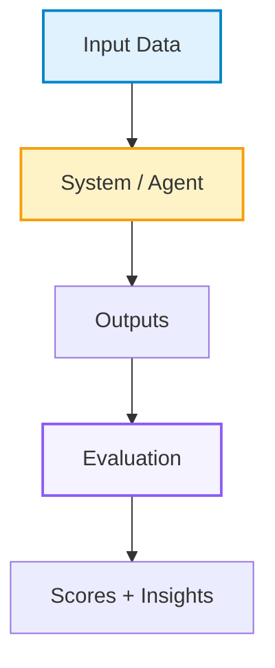

# GitHub README Writing

## 核心原则

- README 要像项目主页：第一屏让读者知道项目名、定位、入口、亮点和视觉印象。
- 严格采用 ResearchClawBench 风格：居中标题、居中 badge、短 tagline、导航链接、teaser 图、highlights 表格、news 前置、Mermaid、项目结构、quick start、community、citation、star history。
- 不要写成纯文档清单。README 应该有视觉层次、表格、图、流程图、结构树、可复制命令和明确入口。
- 可以适度使用 emoji 让 README 更活泼，但 emoji 应服务导航和语义，不要让每行都变成装饰。
- 不编造 badge、指标、论文、license、star、dataset、demo、leaderboard 或 citation。信息未知时使用占位符。
- 对外 README 不写 secret、内部路径、私有 token、未公开服务地址或不可访问链接。

## 推荐结构

按这个顺序组织：

1. Top anchor and centered title。
2. Centered badge block。
3. One-line tagline。
4. Centered navigation。
5. Optional Table of Contents for long README。
6. Teaser image or demo media。
7. One-paragraph project definition。
8. Overview：highlights table、demo、why this project、news。
9. Understanding / How It Works：Mermaid pipeline、stage explanation、rubric or workflow。
10. Results / Domains / Features：多元表格、leaderboard 或 capability matrix。
11. Project Structure：文件夹树。
12. Using The Project：quick start、install、download/configure/run/score。
13. Extension：add your own agent/task/model/plugin。
14. Community：contributing、contact、community images or links。
15. Citation。
16. Star History。
17. Back to top。

## Header 模板

README 顶部优先用 HTML 控制居中布局。

```markdown
<a id="top"></a>

<div align="center">
  <h1>[Project Name]</h1>
</div>

<div align="center">

[]([SITE_URL])&#160;
[]([GITHUB_URL])&#160;
[]([HF_URL])&#160;
[](LICENSE)
[](https://www.python.org/)
[]([GITHUB_URL])

**[Short tagline: what this project evaluates/builds/enables]**

[Quick Start](#-quick-start) | [How It Works](#%EF%B8%8F-how-it-works) | [Features](#-features) | [Leaderboard](#-leaderboard) | [Citation](#-citation)

</div>

<p align="center">
  
</p>

---
```

Badge 数量控制在 5-9 个。优先放 Official Site、GitHub、Hugging Face/Dataset、License、Python、版本/任务数/领域数、GitHub stars。

如果 README 很长，在导航后或 Overview 前加入目录。长章节末尾可加 `[Back to Table of Contents](#table-of-contents)`，主要 section 末尾可加右对齐回顶：

```markdown
## Table of Contents

- [Overview](#overview)
- [How It Works](#%EF%B8%8F-how-it-works)
- [Quick Start](#-quick-start)
- [Citation](#-citation)

[Back to Table of Contents](#table-of-contents)

<p align="right"><a href="#top">🔝Back to top</a></p>
```

## 开场定义

Teaser 后用 1-2 段定义项目。第一句必须回答“这是什么”，第二句说明“为什么不同”。

```markdown
[Project Name] is a [benchmark/system/tool/dataset] that [core action] for [target users/scenario].

Unlike [common baseline/category], [Project Name] asks: *[central question]?*
```

不要在开头先讲安装。先讲价值、对象、核心问题。

## Highlights 表格

Highlights 用 HTML table，四列或两行四列最稳。每个格子包含 icon、粗体标题、短 subtitle。

```markdown
### ✨ Highlights

<table>
<tr>
<td align="center" width="25%">🔄<br/><b>[Highlight 1]</b><br/><sub>[Short explanation]</sub></td>
<td align="center" width="25%">🧪<br/><b>[Highlight 2]</b><br/><sub>[Short explanation]</sub></td>
<td align="center" width="25%">👁️<br/><b>[Highlight 3]</b><br/><sub>[Short explanation]</sub></td>
<td align="center" width="25%">🤖<br/><b>[Highlight 4]</b><br/><sub>[Short explanation]</sub></td>
</tr>
<tr>
<td align="center">🚀<br/><b>[Highlight 5]</b><br/><sub>[Short explanation]</sub></td>
<td align="center">📋<br/><b>[Highlight 6]</b><br/><sub>[Short explanation]</sub></td>
<td align="center">📡<br/><b>[Highlight 7]</b><br/><sub>[Short explanation]</sub></td>
<td align="center">🍃<br/><b>[Highlight 8]</b><br/><sub>[Short explanation]</sub></td>
</tr>
</table>
```

Highlights 不要写实现细节；写用户能记住的能力、规模、覆盖、体验和生态支持。

## News 前置

News 放在 Overview 前半部分，位置要靠前。每条 news 用日期开头、emoji 或短标签、链接和影响。

```markdown
### 📢 News

- **2026-05-21** 📊 [Major update]. Results are available on the [Leaderboard]([URL]).
- **2026-04-30** 🚀 Released [feature/dataset/model].
- **2026-03-19** 🎉 Initial release.
```

News 保持倒序。不要堆太多，主 README 保留 5-10 条；如果 news 过多，用 `<details>` 折叠旧消息：

```markdown
<details>
<summary>👉 More News (Click to expand)</summary>

🚩 **Update** (2026-05-13) [Longer update text with links and impact.]

🚩 **Update** (2026-05-12) [Another historical update.]

</details>
```

## 多元图表

README 至少包含一种视觉图和一种结构图。推荐组合：

- Teaser image：`assets/teaser.png`。
- Demo video/GitHub asset URL：单独放一行。
- Mermaid pipeline：说明数据构造、系统流程、评测流程。
- 表格：features、domains、leaderboard、supported agents、quick comparison。
- 图片截图：UI、leaderboard、evaluation view。
- Star history：放结尾。

Mermaid 示例：

````markdown

````

如果 Mermaid 在目标平台不渲染，要提供 PNG fallback 或截图。

## How It Works

用 `Understanding [Project]` 或 `How It Works` 做解释章节。结构：

1. Mermaid 总流程。
2. 每个 stage 用小标题解释。
3. 每个 stage 后面列 3-5 个动作或产物。
4. 如果有评测或 rubric，用表格说明分数含义。

Rubric 表格示例：

```markdown
| Score | Meaning |
|:---|:---|
| **0** | Criterion absent |
| **1-40** | Partial or flawed result |
| **41-50** | Comparable to reference |
| **51-70** | Better than reference |
| **71-100** | Strongly surpasses reference |
```

## Results / Features 表格

用表格把项目覆盖范围讲清楚。

```markdown
| Domain / Feature | Example Topics | Data Types / Support |
|:---|:---|:---|
| **[Domain 1]** | [examples] | `.csv`, `.json` |
| **[Domain 2]** | [examples] | `.png`, `.pdf` |
```

Supported agents / integrations：

```markdown
| Agent / Tool | Command | Notes |
|:---|:---|:---|
|  **[Name]** | `[command]` | [notes] |
```

## Project Structure

项目结构树必须具体，不要只写顶层目录。

````markdown
### 📁 Project Structure

```text
[ProjectName]/
├── [module]/                 # Core module
│   ├── [file].py             # Main entry
│   └── ...
├── assets/                   # Teaser, screenshots, logos
├── configs/                  # Example configs
├── data/                     # Small examples or metadata
└── README.md
```
````

不要把大型 generated/cache/output 目录写成用户应该提交的内容；可标注 `gitignored`。

## Quick Start

Quick Start 要可复制执行，通常 4-6 步：

````markdown
### 🚀 Quick Start

#### 1. Install

```bash
git clone [GITHUB_URL]
cd [REPO]
pip install -r requirements.txt
```

#### 2. Configure

```bash
cp .env.example .env
# edit .env
```

#### 3. Run

```bash
python -m [package_or_entrypoint]
```

#### 4. Open

Open **http://localhost:5000**.
```
````

如果项目涉及模型/API key，必须使用 `.env.example`，不要在 README 写真实 key。

## Extension Sections

根据项目类型添加：

- benchmark：`Submit New Tasks`、`Add Your Agent`、`Leaderboard`。
- dataset：`Download Data`、`Dataset Schema`、`Hugging Face Mirror`。
- tool/system：`Configuration`、`Plugin/Agent API`、`Deployment`。
- paper repo：`Reproduce Results`、`Checkpoints`、`Citation`。

扩展入口要给最小配置片段，例如 JSON agent config：

```json
{
  "my_agent": {
    "label": "My Agent",
    "cmd": "my-agent run -m <PROMPT> -w <WORKSPACE>"
  }
}
```

## Community And Citation

Community 放在正文后半部分。必须包含至少一种联系方式。

```markdown
## Community

### 🤝 Contributing

We welcome contributions in several forms:

- **New tasks / datasets**
- **New agents / integrations**
- **Bug reports**

📧 **Email**: [name@example.com](mailto:name@example.com)
```

Citation 用 BibTeX，不确定时用占位符：

````markdown
### 📜 Citation

```bib
@software{[key],
  author = {[Authors]},
  title = {{[Project Title]}},
  url = {[GITHUB_URL]},
  year = {[YEAR]}
}
```
````

## Star History

结尾加入 star history。替换 owner/repo。

```markdown
### ⭐ Star History

<a href="https://www.star-history.com/?repos=[OWNER]%2F[REPO]&type=date&legend=top-left">
 <picture>
   <source media="(prefers-color-scheme: dark)" srcset="https://api.star-history.com/image?repos=[OWNER]/[REPO]&type=date&theme=dark&legend=top-left" />
   <source media="(prefers-color-scheme: light)" srcset="https://api.star-history.com/image?repos=[OWNER]/[REPO]&type=date&legend=top-left" />
   
 </picture>
</a>

<p align="right"><a href="#top">🔝Back to top</a></p>
```

## 质量检查

发布前检查：

- 第一屏是否有项目名、tagline、badge、导航、teaser。
- 所有导航 anchor 是否能跳转，尤其含 emoji 的标题。
- 所有图片路径是否存在，alt 文本是否准确。
- Mermaid 是否能在 GitHub 渲染。
- Quick Start 是否可复制执行。
- News 是否倒序且链接有效。
- Tables 是否在移动端不会过宽；必要时减少列数。
- README 没有 secret、内部路径、不可访问链接。
- Citation、license、contact、star history 是否已替换占位符。

## 输出要求

当用户要求“创建 README”时，直接输出或编辑完整 `README.md`，不要只给提纲。除非用户明确要求简版，否则默认使用上述完整结构。

当用户要求“优化 README”时，先检查第一屏、导航、visuals、quick start、community/citation，再改正文。

当项目信息不足时，使用 `[PLACEHOLDER]`，不要编造 URL、数据规模、论文引用或 demo 链接。
