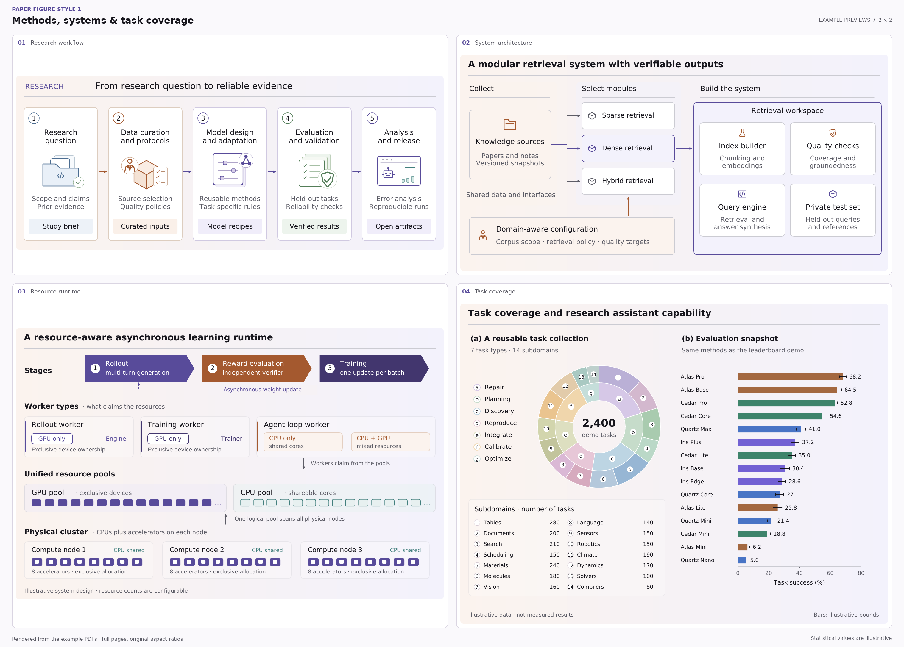
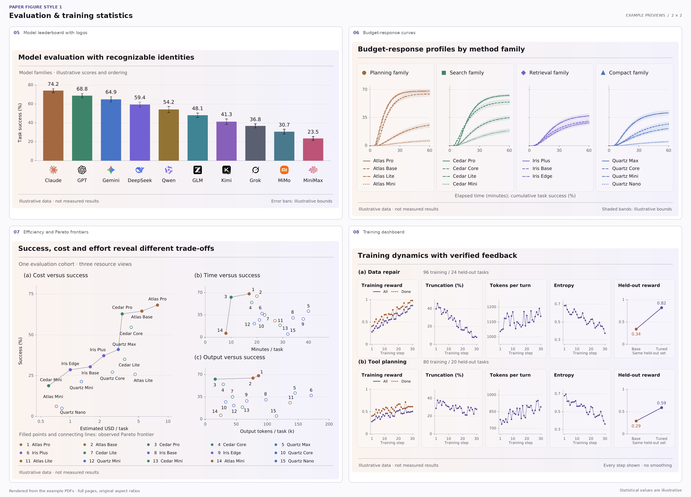

# 论文绘图风格 1

将用户的方法、模块关系和实验数据画成可用于论文的矢量图。核心视觉是浅桃色到淡紫色的连续背景、白色卡片、低饱和分类色、细轴线与统一线性图标。

- **适用**：流程架构图、资源调度图、循环概念图，以及排行榜、区间曲线、成本前沿、多指标矩阵、增益森林图、训练小多图和任务构成图。
- **内容**：根据用户材料定义节点、连线、标签和数据；统计示例明确使用虚构演示数据，不能当作用户的实验结果。
- **输出**：以 PDF 为正式产物。文字保持文本对象并嵌入字体；渐变使用原生 PDF shading；统计图形、线性图标和边框使用矢量路径。模型 logo 复用内置透明 PNG，小尺寸嵌入，不栅格化图表。
- **示例**：17 个完整、独立的需求，代码、logo 资产和依赖均可随 skill 分发；无需外部论文、账户或在线服务，也不生成与原图的对照图。

## 效果预览

以下两张 2×2 图集展示 8 个示例，均从代码生成的 PDF 转为 PNG，保留完整画幅和比例。统计数据仅为演示；正式绘图仍输出文字可复制的 PDF。点击图片可查看大图。

[](assets/previews/01_methods_and_coverage.png)

[](assets/previews/02_evaluation_and_training.png)

## 文件导航

| 序号 | 文件内容概览 | 关键词 | 触发时机 | 文件路径 |
| --- | --- | --- | --- | --- |
| 01 | 定义浅桃紫渐变、语义配色、字号、描边、圆角、留白和连接线的具体参数；解释如何将这套风格适配到不同研究内容，而不是套用固定文案。 | palette, gradient, peach, lavender, typography, DejaVu Sans, whitespace, arrow, semantic color, PDF shading | 选择图形布局前必须读取；调整配色或背景前必须读取；修改字体、尺寸、边框或连接线前必须读取 | [references/01_visual_language.md](references/01_visual_language.md) |
| 02 | 说明 `Figure` 与图标库的坐标约定、文字基线、渐变裁切、卡片、折线箭头、字体配置和可复制的自定义绘图骨架。 | style1.py, icons.py, Figure, box, gradient, text, baseline, lines, arrow, font, max_width | 新建绘图脚本前必须读取；将示例改为用户内容前必须读取；处理文字溢出、缺字、图标或箭头时必须读取 | [references/02_drawing_api.md](references/02_drawing_api.md) |
| 03 | 列出 17 个独立需求及对应代码和 PDF；说明批量生成、命名合集、PDF 校验，以及把 8 个成品渲染成两张 2×2 预览图集的命令与资源位置。 | render_examples.py, verify_pdf.py, build_previews.py, diagrams, statistics, extension, leaderboard, training, ToUnicode, assets/previews, outputs | 首次运行或选择示例前必须读取；重新生成预览图集或 PDF 合集前必须读取；交付 PDF、检查复制能力或排查输出质量前必须读取 | [references/03_examples_and_validation.md](references/03_examples_and_validation.md) |
| 04 | 说明统计组件的坐标、线性/对数轴、误差线、阶梯区间、横条矩阵、增益表、森林图和双环图的数据结构；包含可运行柱状图骨架与数据语义检查。 | charts.py, demo_data.py, Axes, Scale, error bar, confidence band, Pareto, bar_matrix, forest, nested_donut, check_charts.py | 绘制统计图或替换演示数据前必须读取；调整坐标轴、区间、比例或前沿定义前必须读取；排查数值、透明度或多面板布局问题时必须读取 | [references/04_statistical_charts.md](references/04_statistical_charts.md) |
| 05 | 列出十款内置模型 logo 的名称、资产路径和调用方式；说明带 logo 柱状图的替换数据、透明 PNG 与矢量内容边界，以及 PDF 对小图标的校验。 | model_logos.py, draw_model_logo, model_leaderboard.py, assets, provider, PNG, alpha, logo size, strict-vector, model names | 给柱状图或其他图表添加模型 logo 前必须读取；更换 provider、标签或资产前必须读取；检查 logo 比例、透明度或位图校验失败时必须读取 | [references/05_model_logos.md](references/05_model_logos.md) |

## 快速运行

在本 skill 目录下执行。已有满足依赖的 Python 环境可以直接使用；否则创建独立环境：

```bash
python3 -m venv .venv
.venv/bin/python -m pip install -r scripts/requirements.txt
.venv/bin/python scripts/render_examples.py --book
.venv/bin/python scripts/verify_pdf.py --previews
```

- **Python**：3.10 或更新版本。上述命令适用于 Linux、macOS 和 WSL。
- **结果**：`outputs/` 中包含 17 个单页 PDF；`examples.pdf` 将它们按场景顺序合并，方便直接浏览。仅看统计图可使用 `--group statistics --book --book-name statistics.pdf`；带模型 logo 的柱状图使用 `--examples model-logos`。
- **检查**：`outputs/validation.json` 记录文本提取、字体嵌入、渐变和位图检查结果。
- **预览**：`assets/previews/` 内置两张 2×2 成品图集，可直接浏览；`outputs/previews/` 是本地逐页检查图。两者均由 PDF 渲染，正式交付仍使用 PDF。
- **生成物**：`outputs/`、`.venv/` 与 Python 缓存已由本 skill 的 `.gitignore` 排除。内置预览图集随 skill 分发；更新示例后可运行 `scripts/build_previews.py` 重新生成。

## 绘制用户的图

1. **选结构**：方法关系选择流程、汇合、矩阵或循环；实验结果按排名、预算变化、资源权衡、领域能力或训练动态选择统计示例。
2. **整理内容**：确认术语和箭头含义；统计图确认单位、分母、样本数、汇总方式与区间来源，缺失数据不能当作零。
3. **复用代码**：在用户工作目录中新建绘图脚本，复用 `scripts/style1.py`、`scripts/icons.py`；统计图另用 `scripts/charts.py`。`demo_data.py` 仅供演示，不是用户数据源。
4. **设置版心**：默认逻辑宽度 720、物理宽度 7.2 英寸。依据投稿版式指定 `--width-in`，再检查最终放置尺寸的文字可读性。
5. **验证交付**：运行 `verify_pdf.py`，打开 PDF 或渲染预览检查布局，并实际提取文字核对重要标签。

## 保持这一风格

- **背景**：低饱和、低对比的连续渐变，用来统一画布；不要让背景掩盖内容层级。
- **颜色**：紫色表示方法或计算，赭色表示领域输入或验证，蓝色表示资料，绿色表示通过或确认；同一种含义保持同色。
- **统计配色**：同一方法或家族在多张结果图中保持同色；通过图例、线型、形状或标签补充辨识。分类色与流程语义色可分别映射，不能暗示不存在的优劣关系。
- **文字**：默认 DejaVu Sans，主标题加粗，其余以正常字重为主；正文与说明用深浅两档颜色区分。
- **形状**：细描边、小圆角、有限层叠；避免大阴影、强烈光晕和过多装饰。
- **可编辑性**：不要把整图截图嵌入 PDF，不要用隐藏 OCR 文本覆盖 PNG，不要将可读标签转成轮廓路径。
- **字体**：缺字时换用支持相应字符的 TrueType 字体，再核对提取结果；不要静默替换成方框。
- **拥挤时**：先缩短或换行标签、调整卡片宽度或增大画布高度；不要靠持续缩小字号解决。
- **数据保真**：数值柱从零开始；对数轴明示单位；误差条和区间带由真实数据提供。示例中的区间仅为演示边界，不声称置信水平或统计显著性。
