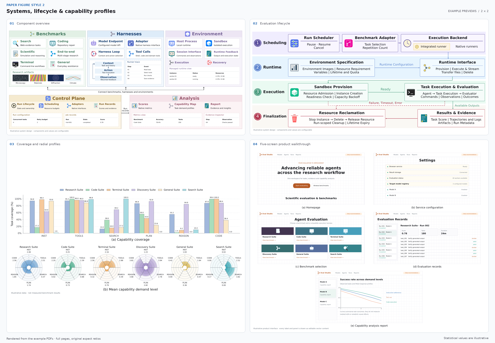
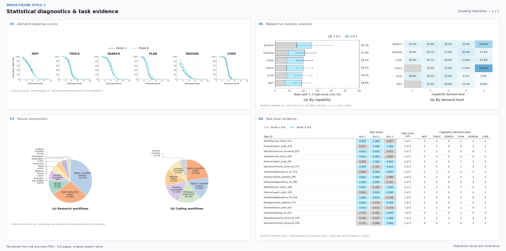
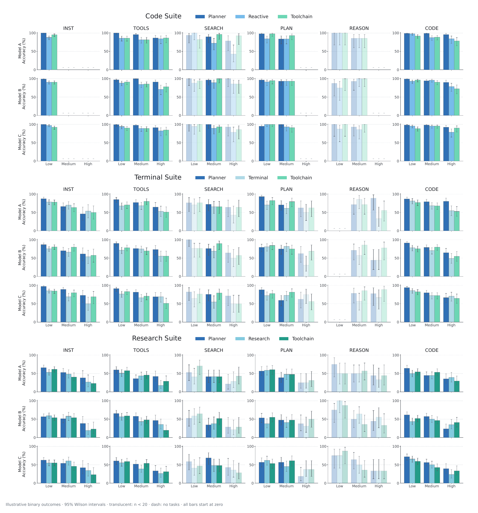

# 论文绘图风格 2

用浅绿、浅蓝、浅紫、米黄和浅粉分区组织系统信息，以亮蓝、洋红、青绿和珊瑚红图标点缀；用白底、细网格与蓝青色系呈现实验结果。这套风格适合模块较多的系统论文，以及需要按模型、能力和任务难度分层展示的评测报告。

- **图型**：组件架构、四阶段生命周期、能力覆盖柱状图与分层径向图、响应曲线、54 面板柱状图矩阵、重复运行分析、失败组成饼图、五屏界面说明和任务明细表。
- **产物**：正式输出为 PDF；文字为真实文本对象，字体嵌入并带 Unicode 映射。卡片、图标、柱、扇区、热力图格子和界面面板均用矢量对象绘制。
- **示例**：9 个可独立运行的需求，不需要原论文、网络服务或其他 skill。统计数据为固定随机种子生成的演示数据；不得当作模型实测结果。

## 效果预览

以下图片全部由本 skill 的代码先生成 PDF，再从 PDF 渲染。点击可查看大图；文字可复制的正式文件在运行示例后生成。

**系统、流程与能力画像**：组件总览、生命周期、覆盖率与径向画像、产品界面说明。

[](assets/previews/01_systems_and_profiles.png)

**统计诊断与任务证据**：响应曲线、横条与热力图、失败组成、带颜色编码的明细表。

[](assets/previews/02_diagnostics_and_evidence.png)

**多模型、多能力对比**：3 个评测集 × 3 个模型 × 6 个能力，共 54 个柱状图面板。

[](assets/previews/03_harness_grid.png)

## 文件导航

| 序号 | 文件内容概览 | 关键词 | 触发时机 | 文件路径 |
| --- | --- | --- | --- | --- |
| 01 | 定义浅彩分区、独立鲜明图标和白底统计图的色值、字体、线宽及九种版式；说明与第一套风格的边界、参考图的覆盖情况和示例适配差异。 | palette, pastel, ICON_PALETTES, PHASES, cyan, zone, Arial, DejaVu Sans, typography, radial sector, layout | 选择图型前必须读取；调整背景、字体或配色前必须读取；核对复现范围或适配其他论文时必须读取 | [references/01_visual_language.md](references/01_visual_language.md) |
| 02 | 说明 `Diagram` 的坐标和文字单位、卡片与图标、泳道连线、可缩放 PDF 导出，以及可直接运行的自定义架构图骨架。 | style2.py, diagrams.py, icons.py, Diagram, theme, card, group, arrow, text, max_width, save_pdf | 新建系统图脚本前必须读取；替换模块或添加图标前必须读取；处理长标签、中文字体或输出尺寸时必须读取 | [references/02_diagram_api.md](references/02_diagram_api.md) |
| 03 | 说明统计组件的数据形状、Wilson 区间、加权二项 logistic 拟合、径向扇区、缺失与小样本语义，以及替换数据的完整柱状图示例。 | charts.py, plots.py, demo_data.py, grouped_bars, wilson, logistic_fit, radial_profile, pcolormesh, NaN, confidence interval | 绘制统计图或替换演示数据前必须读取；选择区间、分母或拟合方法前必须读取；排查缺失格、阈值或图间数值不一致时必须读取 | [references/03_statistical_api.md](references/03_statistical_api.md) |
| 04 | 列出九个模拟需求与代码、单页 PDF 和预览的对应关系；给出批量生成、独立运行、合集、文字与矢量检查和预览重建命令。 | render_examples.py, examples, verify_pdf.py, check_charts.py, build_previews.py, PDF, PNG, ToUnicode, outputs, previews | 首次运行或挑选示例前必须读取；重新生成预览或 PDF 合集前必须读取；交付 PDF、验证复制能力或排查运行失败时必须读取 | [references/04_examples_and_validation.md](references/04_examples_and_validation.md) |

## 快速运行

在本 skill 目录下执行，已有满足依赖的 Python 环境可以直接使用：

```bash
python3 -m venv .venv
.venv/bin/python -m pip install -r scripts/requirements.txt
.venv/bin/python scripts/render_examples.py --book
.venv/bin/python scripts/verify_pdf.py --previews
.venv/bin/python scripts/build_previews.py
```

- **环境**：Python 3.10+；使用 Matplotlib、NumPy、PyMuPDF 和 Pillow，无需 LaTeX、浏览器或在线绘图服务。
- **示例结果**：`outputs/` 中有 9 个单页 PDF 和 9 页 `examples.pdf`。合集保留 PDF 文本和矢量内容。
- **预览结果**：`assets/previews/` 提供两张 2×2 图集及一张完整矩阵，随 skill 分发；`outputs/previews/` 保存本地逐页检查图。
- **本地产物**：`outputs/`、`.venv/` 与 Python 缓存由本 skill 的 `.gitignore` 排除，避免把中间产物与展示资产混在一起。

## 绘制用户的图

1. **选择结构**：模块关系用分区架构；阶段与异常分支用泳道；实验按覆盖率、难度响应、条件比较、组成或逐任务证据选择示例。
2. **确认输入**：确定术语、连线含义和分区；统计数据确认单位、分母、任务数、缺失值、分组和区间来源。
3. **复用组件**：系统图使用 `style2.py`、`icons.py`；统计图使用 `charts.py`；完整布局可调用 `diagrams.py`、`plots.py`，或从示例扩展。
4. **导出 PDF**：默认宽 11 英寸；用 `--width-in` 调整物理宽度。密集图按最终论文放置尺寸检查，过小时拆图，不靠持续缩小字号塞入。
5. **验证交付**：运行 PDF 验证并目视检查 PNG；核对文字可提取、字体嵌入、图形无栅格化、标签未溢出、数值和区间语义正确。

## 核心规则

- **分区图**：使用低饱和纯色底、稍深的标题条、细描边和有限圆角；连线采用明确的实线正常路径与红色虚线异常路径。
- **图标色**：图标独立使用较高饱和度的语义配色；默认由 `ICON_PALETTES` 提供主色与点缀色，用 `icon_color` / `icon_accent` 覆盖。不要让所有图标继承分区标题色，也不要整体提高背景饱和度来补偿灰暗的图标。
- **统计图**：保持白底、轻网格、固定语义配色和统一轴范围；柱状图从零开始，不能用裁断坐标夸大差异。
- **径向图**：每个能力占一个等角扇区，径向长度表达需求等级；不要改成多边形雷达图或把等级误解为面积比例。
- **数值**：缺失组用 `NaN`/零分母表达，显示短横线；有效的零结果必须保留为零。小样本用透明度或 `†` 标识，图注说明阈值。
- **拟合**：标记观测点与拟合线；观测范围以外使用虚线并明确标注外推。二项区间只用于二元任务结果，连续分数应使用与数据匹配的方法。
- **可复制性**：不把整张图片塞进 PDF，不用隐藏 OCR 文本替代真实图中文字，不将标签转为轮廓路径。热力图使用矢量网格，界面示例用原生图形与文字重绘。
- **内容替换**：演示任务、界面和数据用于展示绘图质量。交付真实研究图时替换为用户材料，保留准确的数据说明和需要的来源信息。
